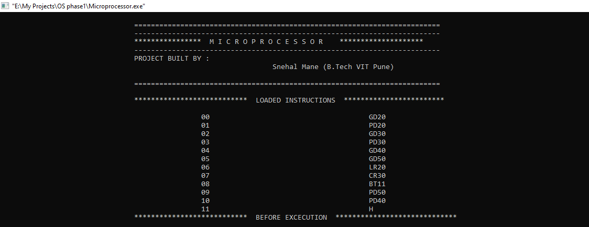
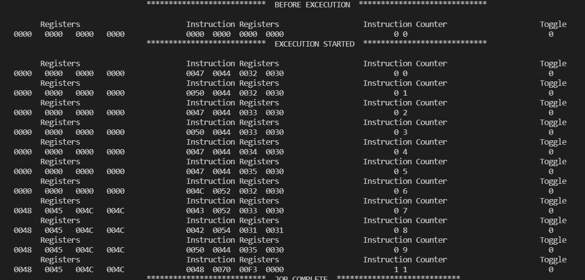
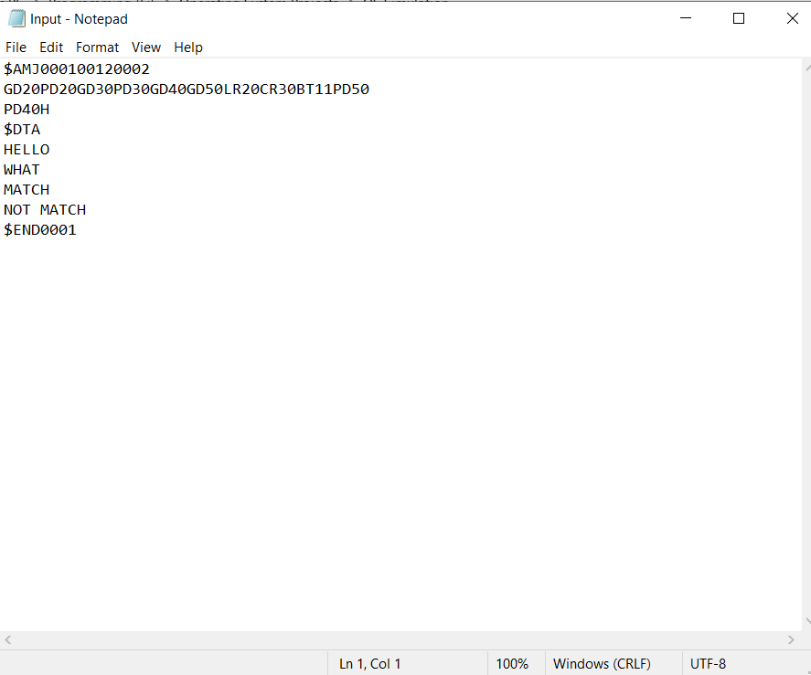
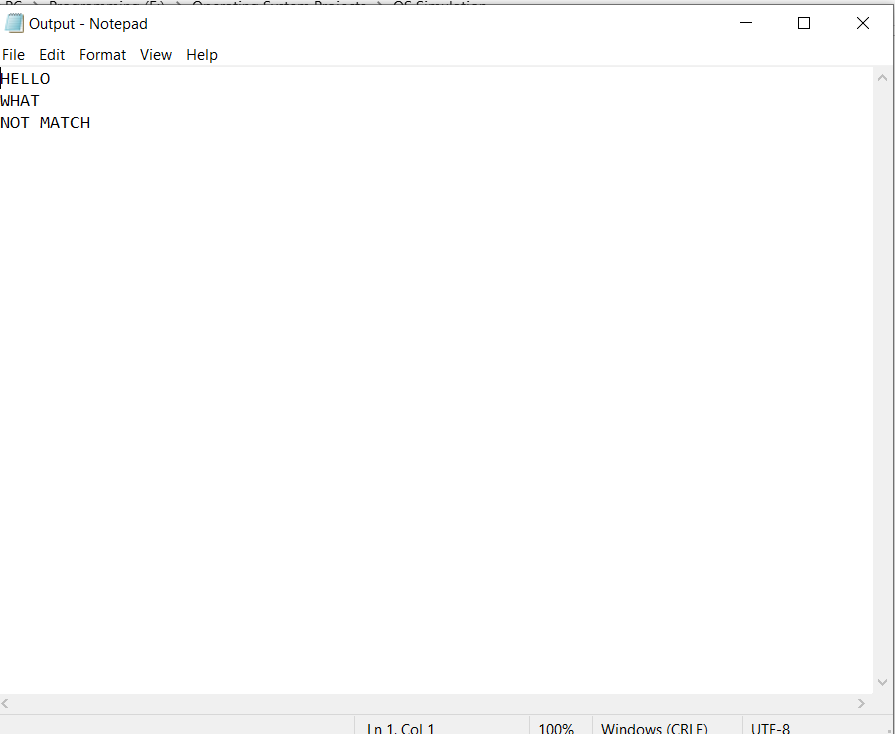

# Microprocessor Simulation

This Project Demonstrate the working of Microprocessor.

## Features

- It stores the data in word format each word have 4 bytes and the data will be stored byte wise.
- It can store upto 100 words.
- The Memory is divided in 10 blocks. Each block have 10 words of memory.
- It will demostrate the working of all components of microprocessor.

##### It has following instructions and their working as follows:

- GD :- This instruction is used to retrive data from the job and store it in the OS Memory. For e.g . GD30 here 30 represent block number. (Note :- block starts from 00,10,20 to 90. 00 is reserved for instructions. Block numbers other than above are invalid e.g. 11,34,78, 00.)
- PD :- This instruction is used to print the data from OS memory to the output screen, here it is output file (output.txt). For e.g. PD30  here 30 represent block number. (Note :- block starts from 00,10,20 to 90. 00 is reserved for instructions. Block numbers other than above are invalid e.g. 11,34,78, 00.)
- LR :- This instruction is used to load the data from specified memory location i.e word number into register. For e.g. LR 31 here 31 represent Memory Location. (Note :- block starts from 00,10,20 to 90. 00 is reserved for instructions. Memory Locations 00 – 09 are invalid.)
- SR :- This instruction is used to Store the data from register into specified memory location i.e word number. For e.g. SR 31 here 31 represent Memory Location. (Note :- block starts from 00,10,20 to 90. 00 is reserved for instructions. Memory Locations 00 – 09 are invalid.)
- CR :- This instruction is used to compare the data from register with specified memory location i.e word number. If the data is same then the will set to 1 otherwise 0. For e.g. SR 31 here 31 represent Memory Location. (Note :- block starts from 00,10,20 to 90. 00 is reserved for instructions. Memory Locations 00 – 09 are invalid.)
- BT :- This instruction is used to check the status of toggle. If the toggle is set then it will jump to the specified instruction number(Note:- The instruction number must be the immediate second instuction after BT). For e.g. BT 11 here BT is the 9th instuction and 11 is instuction number. If the toogle is set i.e 1 then it will will directly jump to the 11th instruction  and if toggle is not set then it will execute the immediate instruction i.e 10th instruction and will skip the 11th instruction. (Note :- block starts from 00,10,20 to 90. 00 is reserved for instructions. Memory Locations 00 – 09 are invalid. This instruction is created to demonstrate compare operations.)
- H :- This instruction will simply terminate the program execution.
## Appendix

Note: - This Project is Developed to demonstrate simple operations performed in microprocessor that is read the data, write the data and compare the data. You can add your instructions and perform different operations.
  
## Documentation

Instructions for writing the job.
- 	First Line of Program Must start with $AMJ followed by xxxx is your program id followed by xxxx is number of instructions in your job followed by xxxx is number of lines in job.
- 	Each Line can have maximum 10 instructions and if your job contains more than 10 instructions then don’t use the 01th block for reading and writing the data
-	After writing the instructions the immediate next line must be $DTA which will represent data segment in the job.
-	In data segment each line must contain data less than 40 bytes (1-byte stores single character).
-	The data mentioned in the first line in the data segment will be stored in the memory block mentioned in the first GD instruction. Second line data will be stored in the memory block mentioned in the second GD instruction and so on.
-	After the end of data segment the immediate next line must be $END followed by xxxx which is your job id.
-	The Job must be written inside a .txt file and pass that file as input. The output will be saved in the Output.txt file in the same directory.


## JOB Example for Compare Operation :-
##### $AMJ000100120002
##### GD20PD20GD30PD30GD40GD50LR20CR30BT11PD50
##### PD40H
##### $DTA
##### HELLO
##### WHAT
##### MATCH
##### NOT MATCH
##### $END0001

## Deployment

To deploy this project run

```bash
The Job must be written inside a .txt file and pass that file as input.
The output will be saved in the Output.txt file in the same directory.
```

  
## Screenshots
### Output 

### Output

### Input.txt

### Output.txt



  
